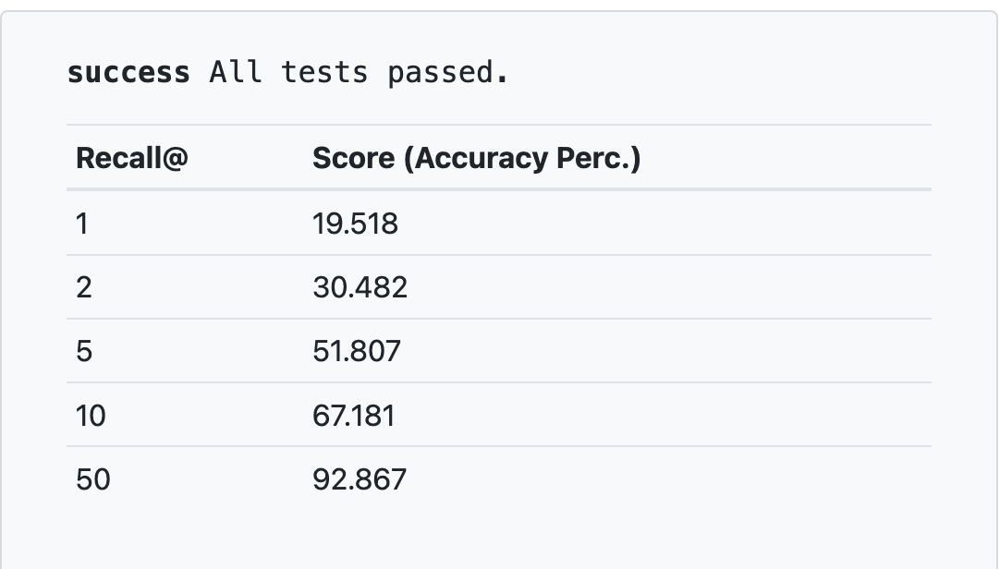

# CIRPLANT

This repository contains the code and pre-trained models for **C**omposed **I**mage **R**etrieval using **P**retrained **LAN**guage **T**ransformers (CIRPLANT)

For details please see our [ICCV 2021 paper](https://arxiv.org/abs/2108.04024) - **Image Retrieval on Real-life Images with Pre-trained Vision-and-Language Models**.


If you find this repository useful, we would appreciate it if you could give us a star.

>You are currently viewing the [code & model repository](https://github.com/Cuberick-Orion/CIRPLANT). For more information, see our [Project homepage](https://cuberick-orion.github.io/CIRR/).


## Introduction
CIRPLANT is a transformer based model that leverages rich pre-trained vision-and-language (V\&L) knowledge for modifying visual features conditioned on natural language.
To the best of our knowledge, this is the first attempt in repurposing a V\&L pre-trained (VLP) model for composed image retrieval- a task that requires language-conditioned image feature modification.

Our intention is to extend current methods to the open-domain. Together with the release of the CIRR dataset, we hope this work can inspire further research on composed image retrieval  

## Installation & Dataset Preparation

Check [INSTALL.md](INSTALL.md) for installation instructions.

## Training

To train the model and reproduce our published results on CIRR:

```bash
python trainval_oscar.py --dataset cirr --usefeat nlvr-resnet152_w_empty --max_epochs 300 --model CIRPLANT-img --model_type 'bert' --model_name_or_path data/Oscar_pretrained_models/base-vg-labels/ep_107_1192087 --task_name cirr --gpus 1 --img_feature_dim 2054 --max_img_seq_length 1 --model_type bert --do_lower_case --max_seq_length 40 --learning_rate 1e-05 --loss_type xe --seed 88 --drop_out 0.3 --weight_decay 0.05 --warmup_steps 0 --loss st --batch_size 32 --num_batches 529 --pin_memory --num_workers_per_gpu 0 --comment input_your_comments --output saved_models/cirr_rc2_iccv_release_test --log_by recall_inset_top1_correct_composition

```

## Results



```
